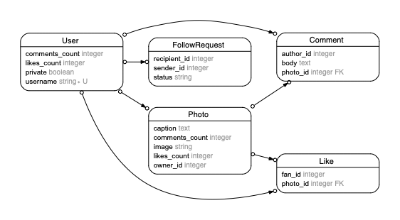

# Photogram GUI

## Walkthrough video

<div class="bg-red-100 py-1 px-5" markdown="1">
**Please note**, the video is from a previous iteration of the project, so there are some differences:

- I am using Gitpod as my cloud editor, so the interface looks a bit different.
- Rather than the _ActiveRecord_ "chapter" in the video, you can keep the lessons on [Contact Book](https://learn.firstdraft.com/lessons/130-contact-book-first-database) and [forms](https://learn.firstdraft.com/lessons/102-query-strings-and-forms) open for reference.
- I use a graphical user interface at the URL path `/git` to commit and push, _you_ should use [the VSCode built in workflow in this lesson](https://learn.firstdraft.com/lessons/50-git-commit-and-push)
- I use `bin/server` to start my live app preview, _you_ should use `bin/dev`
- I use `rails sample_data`, _you_ should use `rake sample_data`
- You should drop the `.html.erb` when rendering a view template:
    `render({ :template => "photo_templates/index" })` 
    _instead of_ 
    `render({ :template => "photo_templates/index.html.erb" })`)
- I use `get` routes for everything, _you_ should use `post()` routes in `config/routes.rb` and `<form action="" method="post">`  in your view templates when modifying the database during `create` and `update` actions
</div>

Did you read the differences above? Good! Then [here is a walkthrough video for this project.](https://share.descript.com/view/sYmmL9OgLIN)

The lesson below contains some additional details, but the video should mostly guide you through the project.

## Getting started

In this project, you will build a photo sharing social network app: Photogram. You will build the app from scratch, adding a Graphical User Interface (GUI) allowing users to **c**reate, **r**ead, **u**pdate, and **d**elete into your database tables.

Here is your target: [photogram-gui.matchthetarget.com](https://photogram-gui.matchthetarget.com/)

This project includes automated tests, so click on this button to get started:

LTI{Load Photogram GUI assignment}(https://grades.firstdraft.com/launch)[S9ymPy6WCsn18gLbByVbZQ7k]{vfdtzJb5bLYqYwuqgeRKpc5d}(10)[Photogram GUI Project]

If you look at the `config/routes.rb` file, or navigate to `/rails/info` after staring your live app preview, you'll see that there aren't any routes defined yet. We have to build them all ourselves.

However, we're not starting completely from scratch. Navigate to `/rails/db` in the live app preview, and you'll see that the database exists already.

Also, crucially, the models already exist in the `app/models/` folder; and within the models, I've already defined the "association accessor" methods that we practiced writing together in _Refactoring Must See Movies GUI 1_. These methods make it much easier to actually _use_ the foreign keys and join tables that we painstakingly planned out in our domain model, rather than having to write cumbersome `.where` queries all over the place.

Spend some time reading the methods in the models; particularly the ones in `app/models/user.rb`. There are a _lot_, because in a social network there are so many important relationships between entities, and the whole point of the application is to query these relationships.

Once you're comfortable with the methods, let's proceed to building the interface. Having these methods at our fingertips is going to make our job a _lot_ easier.

## Domain model

For a quick overview of your database, here is the entity relationship diagram (ERD):



You can also always look at the comments at the top of each of your models in `app/models` to remind yourself of what columns it has.

## Tasks

The required tasks are:

 - `/users` should
    - display all the users
    - a link to get to details for each user
    - a form to add a new user
 - `/users/[USERNAME]` should
    - display the username of the user
    - the photos posted by the user
 - `/photos` should have a form to add a new photo
 - `/photos/[ID]` should
    - display the details of a photo
    - displays the comments that have been made on the photo
    - have a form to add a comment to the photo

## Workflow

 1. As often as you like, reset your database with sample data: `rake sample_data`
 2. Start the web server: `bin/dev`
 3. *Always Be Committing (ABC)* using [our git workflow](https://learn.firstdraft.com/lessons/50-git-commit-and-push)
 4. Check out your database visually at `/rails/db`
 5. Run `rake grade` as often as you like to see how you are doing, but **test whatever you're working on manually first to make sure it matches the target's behavior**. Don't debug using `rake grade`; that is a terribly slow feedback loop.

## Things to keep in mind

- I added some _validations_ ([recall from the previous lesson](https://learn.firstdraft.com/lessons/152-data-integrity-with-validations)), rules to try and help prevent bogus data from entering your tables, to your models. If your record is mysteriously not saving, then a validation is failing (or you just forgot to call `.save`, which I do all the time).
- Don't be alarmed by the number of automated tests. Most of them are there as hints to help you structure your forms correctly.
- It's okay to View Source on the target to get hints on what HTML we used.
- When you make forms, don't forget to add a `<label>` for every form control (`<input>`, `<textarea>`, etc). The `<label>` should have a `for=""` attribute that matches the `id=""` attribute of the input. For example,

```erb
<label for="zebra">Fan</label>
<input id="zebra" type="text" name="qs_fan_id">
```
